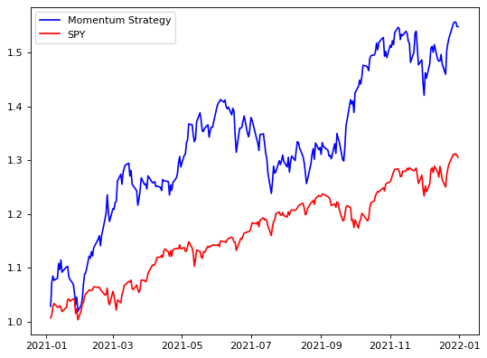

# Momentum Investing Screener

Momentum investing refers to investing in assets that have increased in price the most (i.e. higher recent price return).

**Please refer to csv file for project result based on data as of Feb 19, 2022.**

## Momentum Strategy Backtest with Historical Data from 01/01/2021 to 12/31/2021.

Our portfolio built from momentum strategy has consistently led to better cumulative returns, relative to SPY from 01/01/2021 to 12/31/2021.
